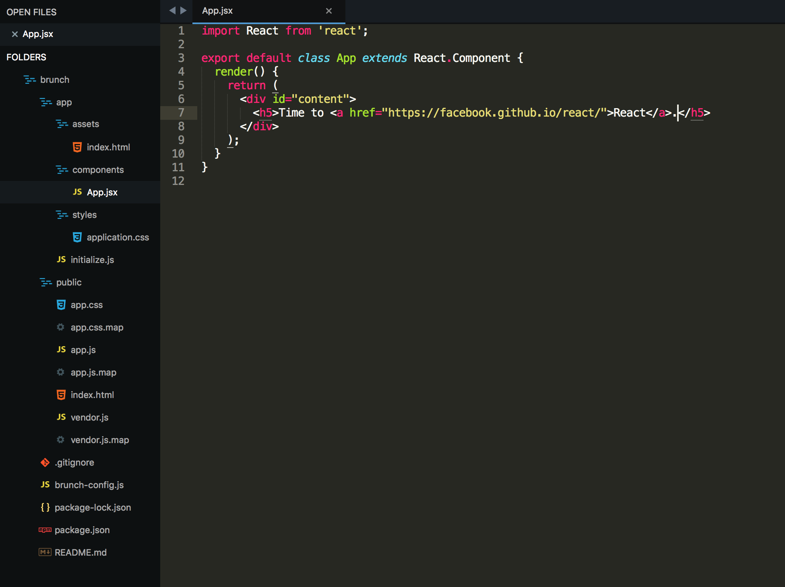

Setting up a new React app with correct dependencies and tools can be a pain, and sometimes it seems like getting things set up is the hardest part! Anything that can can make this simpler is a godsend and thats where **Brunch** comes in. If you want a quick overview of React I have a post that goes over some concepts [here](http://jonathan-meaney.com/2018/03/18/basic-react-component-structure-and-concepts/)
[Brunch](http://brunch.io/) is a tool that can create customised skeletons apps that use the tech you want, with things configured and ready to go straight away. You'll need to have **Node** installed if you want to use Brunch. If you're already using React then you should already have **Node** installed, you can check by running on the command line

```
node -v
```

If you don't have Node then you can install it using NVM in the next step.

## Install Node (If you don't have it already)

NVM (Node Version Manager) is the best way to install Node. Its a handy tool that you can use to install different versions of Node along with NPM (Node Package Manager). Follow the install directions for you platform of choice on <https://github.com/creationix/nvm>
When you are up and running I'd suggest installing the latest **LTS** version of Node. This is currently **8.10.0**but there may be a newer version when you are doing this, you can check the latest **LTS** version on <https://nodejs.org/en/> and to install that using **NVM** run

```
nvm install 8.10.0
```

## Install Brunch

If you have Node installed then use **NPM** to install **Brunch**(-g installs the package globally and can be accessed anywhere)

```
npm install -g brunch
```

Brunch Skeletons are basically application boilerplate that give you an excellent starting point for the application you want to develop. Depending on which technologies you wish to use there is probably a Skeleton ready for you to use. You can search the available list of Skeletons at <http://brunch.io/skeletons> and find the one that best suits your needs. Im going to go with the **React** skeleton. It uses Babel, ES6 and React. Install using the following commands.

```
# Navigate to wherever you are going to do your work
# and create a new directory for the app

mkdir simpleApp
cd simpleApp

# Run the brunch command to install the skeleton
brunch new --skeleton brunch/with-react
```

You'll now have the skeleton app ready for development. To start the application run

```
brunch watch --server
```

then navigate to **http://localhost:3333** in the browser and you should see something like this if everything has been successful.


Brunch React Skeleton Initial Page

Open the directory you installed the skeleton in using your IDE. I use Sublime 3. The directory structure and **App.jsx**file should look like this.


Directory structure and App.jsx contents

Make some changes to **App.jsx** and those changes will be reflected in the browser straight away.
