# 1. Getting started

## 1.1 Fork the starter app

The first step is to fork the starter application on Codesandbox. The starter has all the packages we will need already added and configured.

Make sure you are signed into Codesandbox and go to the following URL:

<https://codesandbox.io/s/functional-components-intro-starter-3ivou?file=/src/App.js>

Click on the `Fork` button in the upper right area of the UI.

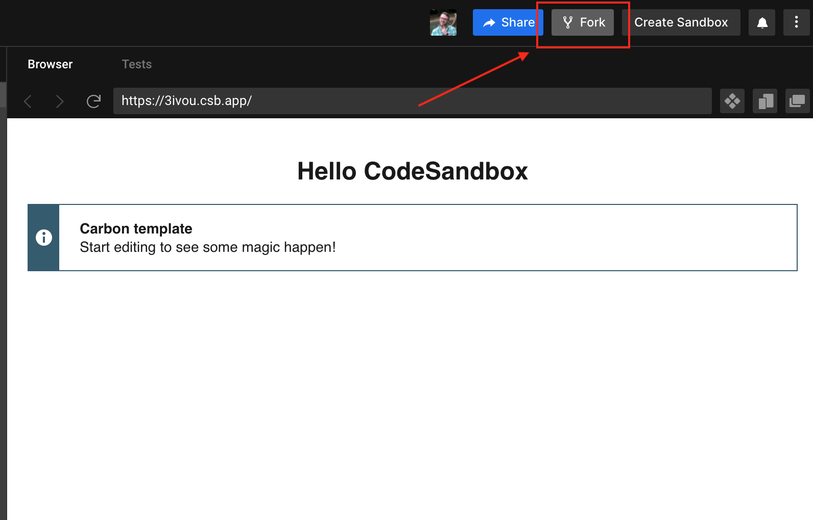

Now the starter has been forked into a new sandbox in your account and can be modified.

You should see a default Carbon message to show that everything is setup correctly to use Carbon.

The first thing to do is to remove the unnecessary default code in `App.js`. Replace the contents with the following:

```javascript
import "./styles.scss";

export default function App() {
  return <div></div>;
}
```

Notice that `App` is a functional component declared using the function syntax.

We will be doing all our work withing this component for this tutorial.

## 1.2 Change Codesandbox settings

By default Codesandbox will attempt to preview changes on every keypress.

This can lead to lots of rendering waiting time. I prefer to disable this option in the settings. This means that the preview will only update on `save`.

### 1.2.1 Open Codesandbox settings

From the menu choose `File > Preferences > Codesandbox Settings`

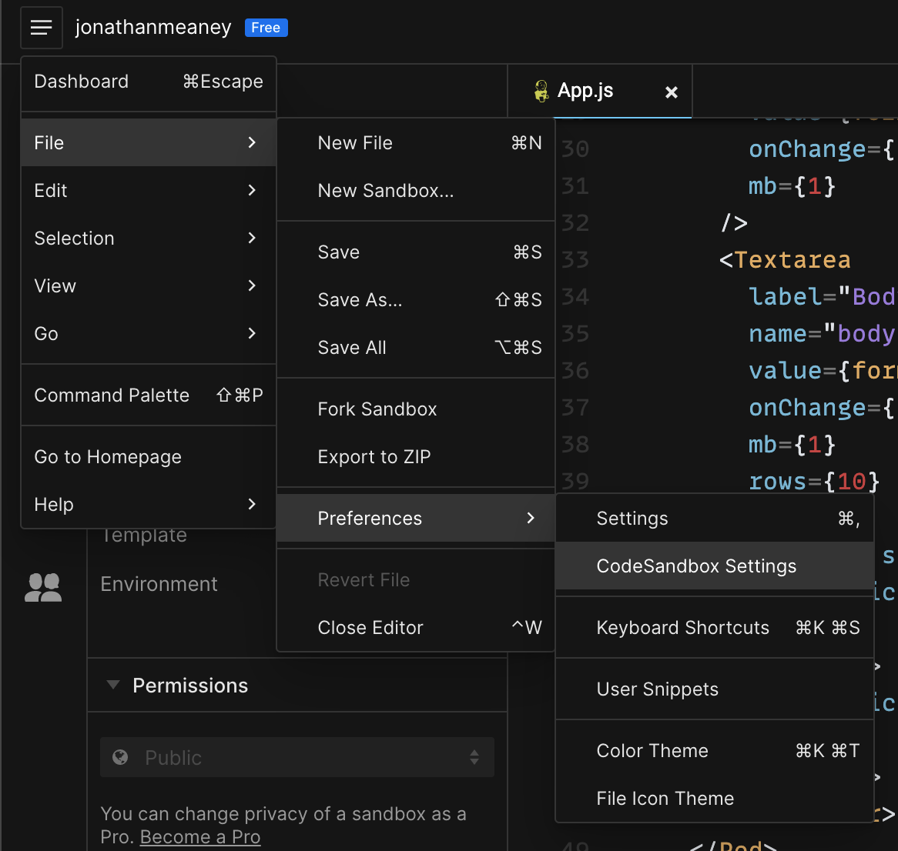

In the dialog that pops up switch off the `Preview on edit` option and then close the settings.

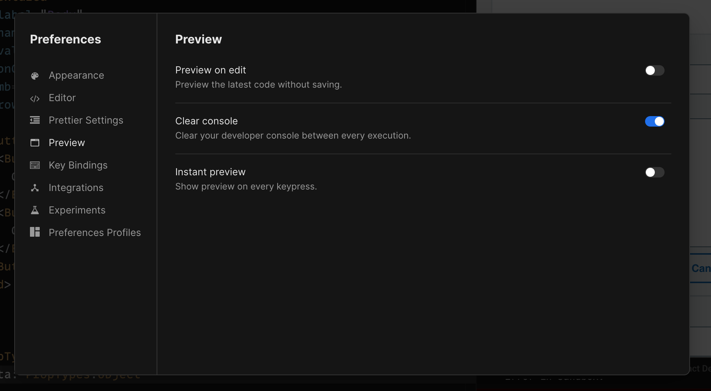

Now when you make changes to a file the preview won’t try to update constantly. It will just update when you save any changes.

## 1.3 What will we make?

We are going to make a very basic Posts app with some basic CRUD features.

The screenshot below is what the end UI should look like.

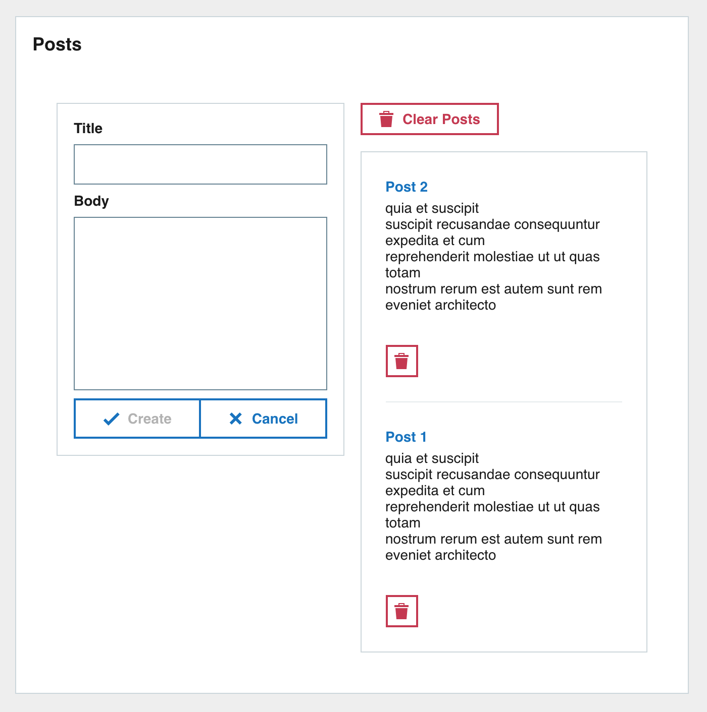

### 1.3.1 Breakdown

Lets take the screenshot of the final UI and break it down into its individual parts. This will make it easier to implement.

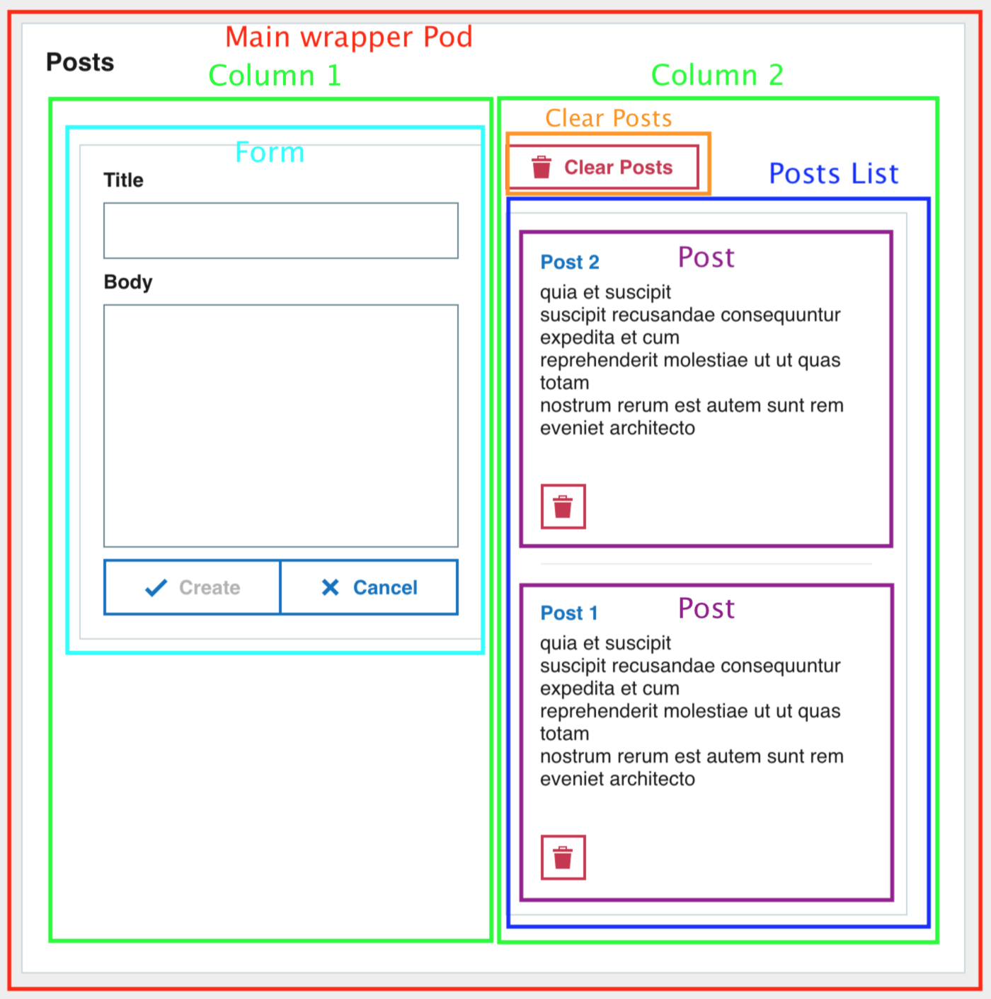

The outer `Pod` contains two columns. OThe left one with a `Form` and the right with the posts list.

We can break down the UI into the following tree:

> - Outer wrapper Pod
> - Column 1
> - Post form
> - Column 2
> - Clear posts button
> - Posts list
> - Post

# 2. Build app structure

The main structure of the app from the tree above is a main wrapper `Pod` with two columns for children.

## 2.1 Add the wrapper Pod

Lets start at the root of the tree. We need to create the wrapper pod for the app.

In `App.js` first import the [Pod](https://carbon.sage.com/?path=/docs/pod--default-story) component from Carbon.

```javascript
import Pod from "carbon-react/lib/components/pod";
```

And then add the `Pod` as a child of `<div>` and set the `title` prop of the `Pod` to be `Posts`.

```javascript
import Pod from "carbon-react/lib/components/pod";

import "./styles.scss";

export default function App() {
  return <div></div>;
}
```

After making the code changes the preview pane in Codesandbox will update and you will see the empty `Posts` `Pod`.

## 2.2 Adding columns

The main content of the application is in two columns. Use the [GridContainer](https://carbon.sage.com/?path=/docs/grid--default-story) and `GridItem` components to implement a two column layout.

```javascript
import { GridContainer, GridItem } from "carbon-react/lib/components/grid";
```

The `GridContainer` component will contain the columns. We need two columns so there will be two `GridItem` components.

The `gridColumn` prop follows the CSS [grid-column](https://developer.mozilla.org/en-US/docs/Web/CSS/grid-column) property and specifies the `GridItem` size and location within the the column.

A `gridColumn` prop value of `1/7` and `7/13` will create two equally wide columns.

Add the `GridContainer` with `GridItem` children to the `Pod`.

```javascript
import Pod from "carbon-react/lib/components/pod";
import { GridContainer, GridItem } from "carbon-react/lib/components/grid";

import "./styles.scss";

export default function App() {
  return <div></div>;
}
```

The UI should now look like this. No major changes but the two columns are there now for use.

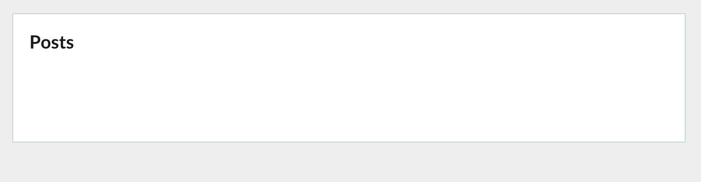

# 3. Build form

Now lets create the main component contained in the left column, the post form.

## 3.1 Form component

### 3.1.1 Form inputs

The form is composed of a titleless `Pod` wrapper containing a [Textbox](https://carbon.sage.com/?path=/docs/textbox--default-story) for post title and [Textarea](https://carbon.sage.com/?path=/docs/textarea--default-story) for post body. There are also form button controls for creating the post and clearing the form underneath the input controls.

First lets import the new Carbon components that we will be using.

```javascript
import Textbox from "carbon-react/lib/components/textbox";
import Textarea from "carbon-react/lib/components/textarea";
import Button from "carbon-react/lib/components/button";
import ButtonBar from "carbon-react/lib/components/button-bar";
```

Create a `Pod` component with the `variant` prop set to `secondary`. This will give the `Pod` a different colour and make it stand out more.

Its first child will be a `Textbox` component with the `title` prop set to `Title`.

The second child is a `Textarea` component with the `title` prop set to `Body`. `Textarea` has prop `rows` which corresponds to the number of rows the `Textarea` will cover, set it to `10`.

You can notice the `mb` prop used on both components. `mb` stands for margin bottom and sets a margin bottom value for the components. Most components support these props and there are versions all sides if needed.

Insert the `Pod` inside the first `GridItem`. This is the left column.

The code should look like this after inserting the `Pod`.

```javascript
import Pod from "carbon-react/lib/components/pod";
import { GridContainer, GridItem } from "carbon-react/lib/components/grid";
import Textbox from "carbon-react/lib/components/textbox";
import Textarea from "carbon-react/lib/components/textarea";
import Button from "carbon-react/lib/components/button";
import ButtonBar from "carbon-react/lib/components/button-bar";

import "./styles.scss";

export default function App() {
  return <div></div>;
}
```

The UI preview will update in Codesandbox and you should see the new form inputs that you entered in the left column.

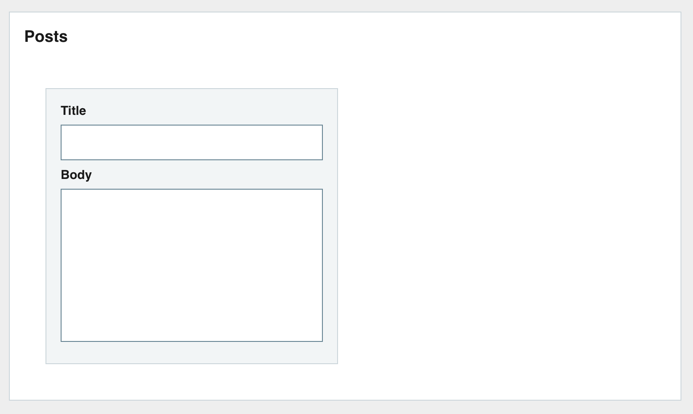

### 3.1.2 Form action buttons

The form has two action buttons. A `Create` button and a `Cancel` button.

The `Create` button will create a new post from the input data and the `Cancel` button will clear the contents of the form.

We will use the [ButtonBar](https://carbon.sage.com/?path=/docs/button-bar--sizes) component (previously imported) to hold the two action buttons. The `ButtonBar` component groups [Button](https://carbon.sage.com/?path=/docs/button--primary) components together nicely.

Create a new `ButtonBar` component and give it the `fullWidth` prop to make the bar and any buttons span the full width, also set the `size` prop to `medium`.

Add two `Button` components as children, one with `Create` text and the other `Cancel`. The `Button` component has an `iconType` prop which is the icon that will be displayed in the button. Use `tick` for the `Create` button and `cross` for the `Cancel` button.

```
  Create
  Cancel
```

Insert the `ButtonBar` under the `Textbox` and `Textarea`.

```
    Create
    Cancel
```

Your form should now look like this.

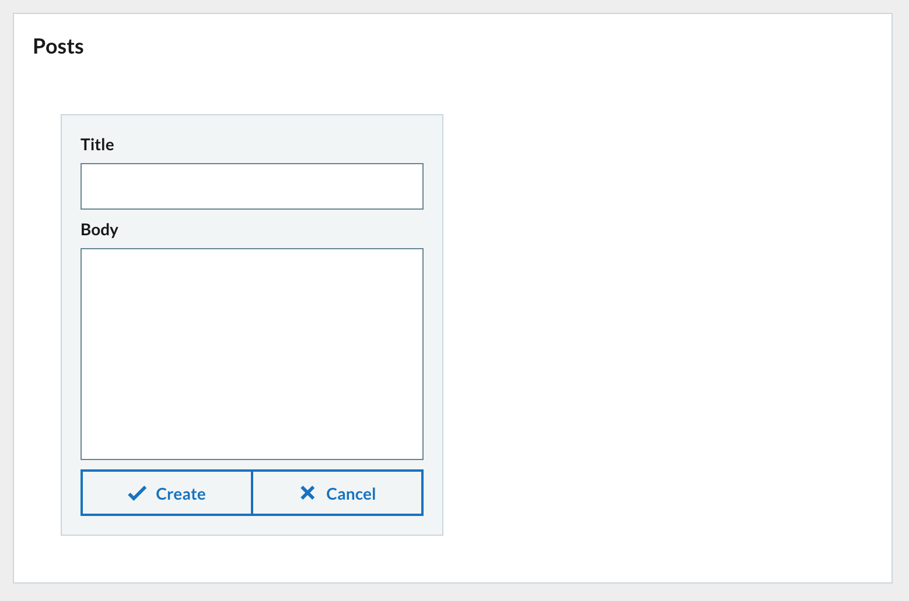

## 3.2 Form state

The form is in place but at the moment it doesn’t do anything. We need to connect the inputs with a data store. We will use the `useState` hook to create a state for the form to use.

First import the `useState` hook from the `react` package by adding the import tot the top of the file.

```javascript
import React, { useState } from "react";
```

We will create a `formData` state. The inital value of the state is an object with blank `title` and `body` properties. This object will hold that state of the forms inputs.

The `useState` hook returns an array of values. The first value corresponds to the current state and the second value is the function used to update the state. Use array destructuring to assign the values. `formData` is the current state and `setFormData` is the function used to update the state.

```javascript
const [formData, setFormData] = useState({ title: "", body: "" });
```

Add just after the component declaration.

```javascript
export default function App() {
  const [formData, setFormData] = useState({ title: "", body: "" });
```

## 3.3 Connect form to state

### 3.3.1 Populate inputs from state

Now that we have the state set up for the form to use we need to connect everything together. The form inputs should display values retrieved from the `formData` state and changing an input should update the `formData` state accordingly.

Update the `Textbox` and `Textarea` components. Set the `value` prop to read the corresponding value from the `formData` state. This will populate the inputs with the current value from the state.

### 3.3.2 Update state on change

When one of the form inputs is changed we need to have an event handler function that will update the `formData` state. Create a new arrow function called `updateFormData` with `e` (event) as a parameter.

Add the function under where you added the `formData` state.

```javascript
const updateFormData = (e) => {
  // destructure the name and value from the event target
  const { name, value } = e.target;

  // Call setFormData and update formData.
  // Creating a new object and using the spread syntax
  // to populate the object with the current contents of formData.
  // Then update the specific property name with the value from event.
  setFormData({
    ...formData,
    [name]: value
  });
};
```

The contents of the `updateFormData` function are a very common pattern you will come across.

Now that the event handler function is in place lets connect the inputs to it. Update the `Textbox` and `Textarea` setting the `onChange` prop to `{updateFormData}`. When the `onChange` event is triggered the `updateFormData` function will be called and an event object will be passed into it.

Now any time you make a change to either the `Textbox` or the `Textarea` the `updateFormData` function will be called. The input `name` and `value` will be taken from the event and the state will be updated accordingly.

## 3.4 Clear form

Lets create an easy way to clear the form from the cancel button.

Create a handler function to clear the form data when the cancel button is clicked. This simple function will call the `setFormData` function and update the state to its initial value. We don’t care about the event object this time so there is no needs to add it.

Add the function under the `updateFormData` function.

```javascript
const clearFormData = () => {
  setFormData({ title: "", body: "" });
};
```

Then update the `onClick` prop of the cancel button to use `clearFormData`.

```
  Create

    Cancel
```

Now when you click on the cancel button the `clearFormData` function will be called and the `formData` state will be re-initialized.

## 3.5 Submit form

### 3.5.1 Posts state

We will need somewhere to put posts when we create them. This is another job for `useState`. We will use `useState` to create a `posts` state. This state will be an array of post objects so should be initialized with an empty array.

Add the `posts` state under the `formData` state near the top of the component.

```javascript
const [posts, setPosts] = useState([]);
```

### 3.5.2 Add post to state

Now that we have state setup to hold posts we need a way to add posts to the array.

Create a new handler function called `createPost` under `clearFormData`. This function eventually will be called when the `Create` button in the form is clicked.

In the function create a `newPost` object and spread the contents of `formData` inside. Then add a new `id` property populated by the `uuidv4()` function. This will give the `newPost` object a unique ID.

We then need to add the `newPost` object to the `posts` state.

A feature of the `setState` function from `useState` allows you to pass in a function. This function will receive the previous state and you can use it in the function body.

In the arrow function return a new array with `newPost` prepended with the previous value spread after.

Finally clear the `formData` and call `clearFormData`.

```javascript
const createPost = () => {
  // newPost object populated with title and body and
  // assigned a new ID
  const newPost = {
    ...formData,
    id: uuidv4()
  };

  // Pass in an arrow function to setPosts to get access to the
  // previous value of posts. Use this to prepend newPost
  // in a new array with previousState contents spread after.
  // The result is then set to the posts state.
  setPosts((previousState) => [newPost, ...previousState]);

  // Clear the inputs.
  clearFormData();
};
```

Import `uuidv4` function from the `uuid` package for generating post IDs.

```javascript
import { v4 as uuidv4 } from "uuid";
```

Update the `Create` button `onClick` prop with the `createPost` handler function. When the `Create` button is clicked then the `createPost` function is called and the new post will be added to the `posts` state.

```
    Create


    Cancel
```

### 3.5.3 Prevent creation of blank posts

At the moment you can click on the `Create` button whenever you want and create a new `post`, even if the inputs are empty. To prevent this we can disable the `Create` button using the `disabled` prop. If `true` then the `Button` will be disabled and clicking it will not create a `post.

We just want the `Create` button to be disabled if there are no values for `title` and `body` in the form.

Lets create a variable before the components `return` which will check if either of the `formData` fields are empty and return a boolean value.

```javascript
// The create button should be disabled if title and body have no values
const createDisabled = !formData.title || !formData.body;
```

Set the `disabled` prop of the `Create` button to be the value of `createDisabled`.

```
  Create
```

The `Create` button will now be disabled until there is a value for `title` and `body` in the form.

### 3.5.4 Check everything is working so far!

We now have a functional form and storage for posts but we can’t see anything yet. We can add in some logging to make sure that everything is working properly.

We will use another hook. The `useEffect` hook. This hook will run a function whenever a change has been made. It can be further refined to only run the function when specific changes happen. We will use `useEffect` to log the `posts` state to the console whenever the `posts` state changes.

First import `useState` from the `react` package similar to `useState`.

```javascript
import React, { useState, useEffect } from "react";
```

Then underneath where you have `formDate` and `posts` state defined add a call to the `useEffect` hook. Pass in an arrow function just containing a `console.table('posts', posts);` statement. The second condition of the `useEffect` is the dependency array. Populate it with the `posts` state. This means that the arrow function will only be run on component first render and whenever the `posts` state changes.

```javascript
useEffect(() => {
  console.table("posts", posts);
}, [posts]);
```

If you expand the `Console` tab in Codesandbox you will see the `posts` being logged.

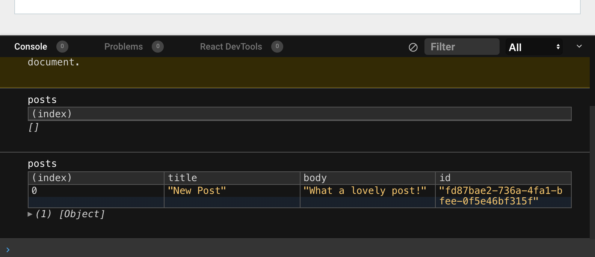

Here is how our `App.js` file looks now after all the changes so far.

```javascript
import React, { useState, useEffect } from "react";
import { v4 as uuidv4 } from "uuid";

import Pod from "carbon-react/lib/components/pod";
import { GridContainer, GridItem } from "carbon-react/lib/components/grid";
import Textbox from "carbon-react/lib/components/textbox";
import Textarea from "carbon-react/lib/components/textarea";
import Button from "carbon-react/lib/components/button";
import ButtonBar from "carbon-react/lib/components/button-bar";

import "./styles.scss";

export default function App() {
  const [formData, setFormData] = useState({ title: "", body: "" });
  const [posts, setPosts] = useState([]);

  useEffect(() => {
    console.table("posts", posts);
  }, [posts]);

  const updateFormData = (e) => {
    const { name, value } = e.target;

    setFormData({
      ...formData,
      [name]: value
    });
  };

  const clearFormData = () => {
    setFormData({ title: "", body: "" });
  };

  const createPost = () => {
    // newPost object populated with title and body and
    // assigned a new ID
    const newPost = {
      ...formData,
      id: uuidv4()
    };

    // Pass in an arrow function to setPosts to get access to the
    // previous value of posts. Use this to prepend newPost
    // in a new array with previousState contents spread after.
    // The result is then set to the posts state.
    setPosts((previousState) => [newPost, ...previousState]);

    // Clear the inputs.
    clearFormData();
  };

  // The create button should be disabled if title and body have no values
  const createDisabled = !formData.title || !formData.body;

  return (
    <div>


                  Create


                  Cancel


    </div>
  );
}
```

# 4. Post list

## 4.1 Create post list

Now that we have a working form and data storage we need a way to display any created posts.

Lets create a `postsList` function that will generate a list of posts for display. We will use the [Tile](https://carbon.sage.com/?path=/docs/tile--default-story) component which displays items nicely with a divider inbetween.

Each `post` will be a new [Content](https://carbon.sage.com/?path=/docs/content--default-story) component. The `Content` component is good for displaying text data with help from [Typeography](https://carbon.sage.com/?path=/docs/typography--variants).

First add the imports for the new components we want to use.

```javascript
import Content from "carbon-react/lib/components/content";
import Typography from "carbon-react/lib/components/typography";
import Tile from "carbon-react/lib/components/tile";
```

Next add the definition for the `postsList` function under the `createPost` function.

```javascript
const postsList = () => {

};
```

The first thing to do is to check if there are any posts in the `posts` state. If not then simply return `No posts yet!`. There is no need to continue if there are no posts to render.

```javascript
const postsList = () => {
  // Handle there being no posts
  if (!posts.length) {
    return "No posts yet!";
  }
};
```

Next we need to handle when there are posts.

We will iterate the `posts` array using the `map` javascript function. Each iteration will return a new `Content` component representing the `post`.

Inside the `map` first use the `Typography` component to create a title for the `post` with `variant` prop `strong` and `color` set to `primary`.

Next create the return for the `map`. Populate with a `Content` component setting the `title` prop to be the title you just created. Set the `key` prop of the `Content` to be `post.id`. The `map` function returns an array and each React component in an array must have a unique `key` value. The child of the `Content` component will be `post.body`.

```javascript
// Iterate the posts in the array and create a new array of
// Content components wrapping the post details
const list = posts.map((post) => {
  // Construct a title using the Typeography component
  const title = (

      {post.title}

  );

  return (

      <div>{post.body}</div>

  );
});
```

Finally after creating the array of `Content` components representing posts we need to add the `return` for the `postsList` function.

We need to return a `Tile` component with its `orientation` prop set to `vertical`. This will display the posts vertically. The child of the `Tile` component is the `list` of posts we created above.

```javascript
// Return a Tile component with the list of posts content as child
return { list };
```

All together this is the final `postsList` function.

```javascript
const postsList = () => {
  // Handle there being no posts
  if (!posts.length) {
    return "No posts yet!";
  }

  // Iterate the posts in the array and create a new array of
  // Content components wrapping the post details
  const list = posts.map((post) => {
    const title = (

        {post.title}

    );

    return (

        <div>{post.body}</div>

    );
  });

  // Return a Tile component with the list of posts content as child
  return {list};
};
```

Now all we need to do is call the `postsList` function. The `postsList` lives in the second column of out UI so thats where the function call will be. Update the second `GridItem` component and call the `postsList` function inside. This will render the posts list in the second column.

```javascript
{
  postsList();
}
```

The preview in Codesandbox should have updated after your changes are saved. If you enter text into the form inputs and click on `Create` then the new post will be displayed in the posts list in the second column.

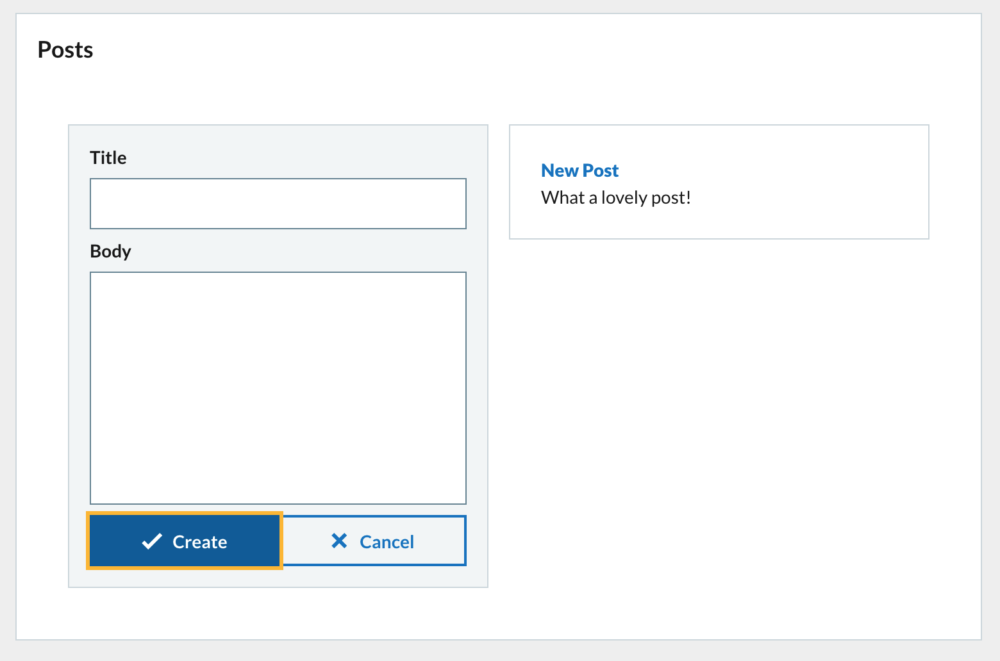

## 4.2 Delete post

Now that we have a list of posts we need a way to delete them. Each post has its own delete button according to the UI breakdown.

Lets add a `deletePost` function under `createPost`. The `deletePost` function accepts a `post` parameter, the `post` to delete.

The contents of the `deletePost` function will use call the `setPosts` state function and using the `previousState` method update the state to filter out the `post` passed into the function.

```javascript
const deletePost = (post) => {
  // Filter the posts array and exclude the one passed to the function
  // Setting the posts array to be the new array
  setPosts((previousState) => previousState.filter((p) => p.id !== post.id));
};
```

Now we need to add a `Button` to call the function when clicked.

We need to update the `postsList` function to include the `Button` for each post.

Update the `Content` component and add another child `Button`. Set the `destructive` prop. Set the `size` prop to `small` and set the `iconType` to `bin`. This will display a red button containing a bin icon to denote delete.

Set the `onClick` prop to call the `deletePost` function. In order to pass a value to a function through an event hander then use an arrow function. Pass in the `post` object.

```javascript
  <div>{post.body}</div>
   deletePost(post)}
  />
```

Clicking the button will now delete the `post` from the `posts` array.

# 5. Clear posts

We need another function that will clear the `posts` array. This will be called by clicking on a `Clear Posts` button.

Add the `clearPosts` function under the `deletePost` function. It is a very simple function. Just call the `setPosts` state function and pass in an empty array `[]`. This will set the `posts` state to be an empty array and remove all the posts.

```javascript
const clearPosts = () => {
  setPosts([]);
};
```

We only want the button to appear when there are posts to delete so update the `return` value of the `postsList` function.

Add another destructive `Button` with `Clear Posts` text. Set the `onClick` prop to the `clearPosts` function you created above.

```javascript
return (


      Clear Posts

    {list}

);
```

Now when the button is clicked all posts will be removed.

And with all all of the UI from our original breakdown has been implemented.

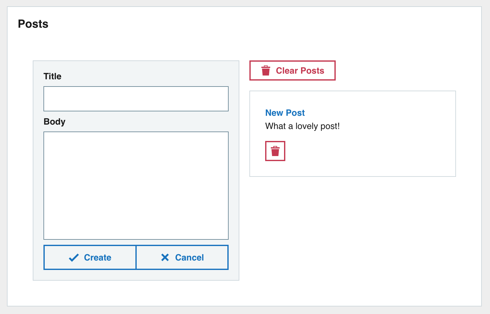

# 6. Refactoring

## 6.1 Create Form component

Lets refactor all of the form functionality into its own `Form` component that we will use.

Add this to `App.js` for now, before the `export default function App()` declaration.

Create a `Form` component using arrow syntax.

```javascript
const Form = () => {};
```

Then transfer all of our form components to the `retrurn`. We will need to add other data and functions for the `Form` as props.

You can use destructing directly on the props object passed into the component and pull out all items we need to use for the `Form`.

```javascript
const Form = ({
  formData,
  updateFormData,
  createPost,
  createDisabled,
  clearFormData
}) => {
  return (


          Create


          Cancel


  );
};
```

Don’t forget to declare the `Form.propTypes` and `Form.defaultProps` after the component. Its important to do so for every component you create. The `propTypes` object lists the accepted `props` and what type of data to expect for it. The `defaultProps` object lets you define default values for `props` that may be missing.

Import the `PropTypes` package and define `propTypes` and `defaultProps`.

```javascript
import PropTypes from "prop-types";
```

```javascript
Form.propTypes = {
  formData: PropTypes.object,
  updateFormData: PropTypes.func,
  createPost: PropTypes.func,
  createDisabled: PropTypes.bool,
  clearFormData: PropTypes.func
};

Form.defaultProps = {
  formData: {},
  updateFormData: () => {},
  createPost: () => {},
  createDisabled: true,
  clearFormData: () => {}
};
```

Finally update the `GridContainer` and render the `Form` component in the left column. Pass in all the appropriate `props`.

```javascript
{
  postsList();
}
```

After adding the `Form` component all the functionality should be the same as before. There should be no difference.

# 7 Next steps

## 7.2 Move Form to own file

Now you can try move the `Form` component and any imports it needs to its own file in the system called `form.js`. Don’t forget to add a default export for `Form` in `form.js`.

Import `Form` from the new file into `App.js` and remove any unsed imports.

## 7.3 Create Post component

Next create a component for `Post`. This component represents a `post` from the `posts` array. The `Post` should have a `title` and `body` and have a delete button. The `Post` should look just like it does in the `postsList` function.

Follow the approach to the `Form` above.

## 7.4 Create PostList component

Next create a component for `PostList`. This component will render an array of `Post` components. The `PostList` will also have the `Clear Posts` button.

Follow the approach to the `Form` above.

> Notice that you need to pass functions from the main `App` component down to `Post` through the `PostList`. This is called `prop drilling`. We will look at solutions to this in a future workshop.

# 8. Finally

You can find the final code for the tutorial in the completed Codesandbox.

<https://codesandbox.io/s/functional-components-intro-complete-b4lw6?file=/src/App.js>.
