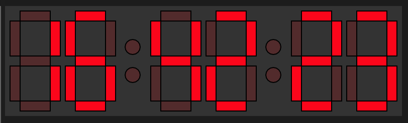

p5.js is an amazing JavaScript library that streamlines creating graphical applications in your browser. Learn more at <https://p5js.org/> They also have an extremely useful online editor <https://editor.p5js.org/> which I used for this example and the link to it will be below.

The beautiful clock

|                                                |                                                                      |
| ---------------------------------------------- | -------------------------------------------------------------------- |
| Resource                                       | URL                                                                  |
| Github source code for the display             | <https://github.com/jonathanmeaney/Seven_Segment_Display_Clock>      |
| p5js editor version of display                 | <https://editor.p5js.org/FugQueue/sketches/q8A2REall>                |
| Inspired by the amazing Coding Train challenge | <https://thecodingtrain.com/CodingChallenges/117-seven-segment.html> |

Resource links

https://gist.github.com/jonathanmeaney/e46183e8ac8995da4931e48cf2ad1a1a
