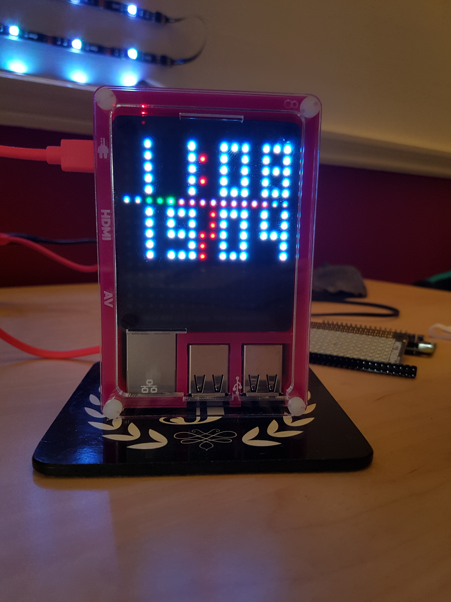
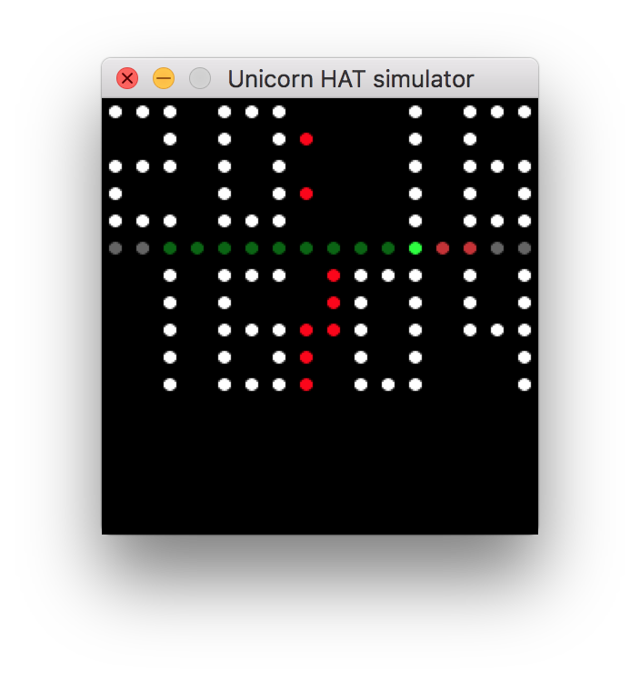

I recently got the excellent Unicorn Hat HD for my Raspberry Pi and its a lot of fun. I created a simple clock program using python to display the current time and date with an animated row to indicate the number of seconds completed in the current minute. It can be left running as it will update in real time. You can find the code on my Github page <https://github.com/jonathanmeaney/unicorn-hat-hd-clock>
My Raspberry Pi Setup:

- Raspberry Pi 3 Model B
- Pibow case from [Pimoroni](https://shop.pimoroni.com/collections/pibow/products/pibow-for-raspberry-pi-3-b-plus)
- Unicorn Hat HD from [Pimoroni](https://shop.pimoroni.com/products/unicorn-hat-hd)

Heres a picture of how the clock looks on my Raspberry Pi and Unicorn Hat HD

The Clock running on the Raspberry Pi with Unicorn Hat HD

Its not necessary to have a Unicorn Hat HD or a Raspberry Pi to run the clock. You just need to have Python installed on your computer along with the Unicorn HAT (HD) simulator. The simulator (<https://github.com/jayniz/unicorn-hat-sim>) is a very handy tool that demonstrates what your code will do on the Unicorn Hat HD. It looks something like this when running.

Display of the clock on the Unicorn HAT (HD) simulator
