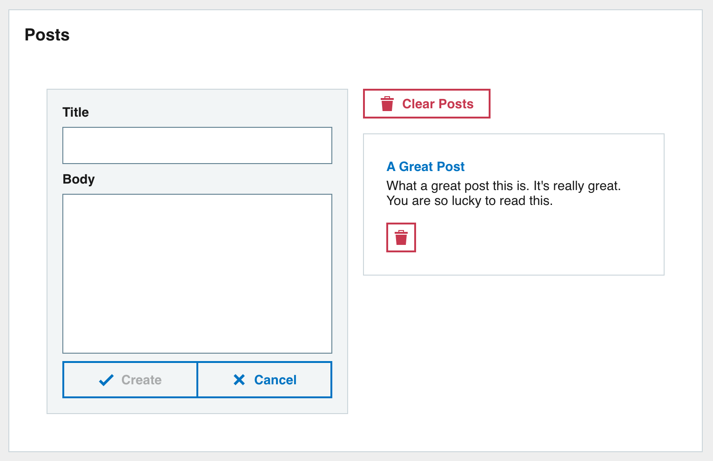

# 1. Getting started

## 1.1 Fork the starter app

The first step is to fork the starter application on Codesandbox. The starter is a slightly modified version of the completed sandbox from workshop 1.

Make sure you are signed into Codesandbox and go to the following URL:

<https://codesandbox.io/s/context-and-hooks-starter-o8cb9z>

Click on the `Fork` button in the upper right area of the UI.


## 1.2 Recap from workshop 1

Workshop 1 created a simple posts application with some basic CRUD functionality.

The completed app from workshop 1 had a two column layout.

The left column contained a `Form` component for post creation.

The right column contained a `PostsList` component that lists `Post` components along with delete functionality.



## 1.3 What will we make?

Workshop 2 will refactor and improve the posts app we made in workshop 1. Updates will incorporate:

- React Context
- Custom Hooks
- Testing with React Testing Library

# 2. Creating Posts Context

## 2.1 Why do we need a Posts Context?

You will notice from the starter application that the `deletePost` function is passed to the `PostsList` component which is turn pass the function to the `Post` component.

This passing of props through a component tree is called `Props Drilling`. A solution to `Props Drilling` is to use the React Context API. The React Context API allows you to share data between components without needing to pass the value to each component.

The 4 steps for creating and using a context:

> 1. Use the `createContext` method, create a context.
> 2. Wrap your context provider around the component tree.
> 3. Populate the value prop of the context provider with what you want to share.
> 4. Within any component use the context consumer or `useContext` hook to read the value.

## 2.2 Create posts-context.js

Create a new `context` directory under `src` with a new file `posts-context.js`.

To create a new context use the `React.createContext` method.

The value you pass to the method is the default value for the context. Populate the value with an object and dummy `deletePost` method.

```javascript
import React from "react";

export default React.createContext({
  deletePost: () => {}
});
```

> Note: The default context value will be used if trying to read the context value from outside the provider

## 2.3 Wrap the context provider in App.js

In `App.js` import the `posts-context`.

```javascript
import PostsContext from "context/posts-context";
```

Then we will wrap the `PostsContext.Provider` around the posts `Pod` and populate the `value` with the `deletePost` function we have defined in `App.js`.

Since we are using the context to pass the `deletePost` function you can remove the `deletePost` prop from the `PostsList` component.

```jsx
<div className="app">
  <PostsContext.Provider
    value={{
      deletePost
    }}
  >
    <Pod title="Posts">
      <GridContainer>
        <GridItem gridColumn="1/7">
          <Form onSubmit={createPost} />
        </GridItem>
        <GridItem gridColumn="7/13">
          <PostsList posts={posts} clearPosts={clearPosts} />
        </GridItem>
      </GridContainer>
    </Pod>
  </PostsContext.Provider>
</div>
```

Now that we have wrapped the components with the context provider any wrapped component can read the value from the context.

## 2.4 Read value from context

The `deletePost` function we added to the context can be used by the `Post` component.

In `components/post.js` import the `useContext` Hook. This Hook is used to read from a context. We also need to import the `PostsContext` context.

```javascript
import React, { useContext } from "react";

import PostsContext from "context/posts-context";
```

We wont be needing the `deletePost` prop anymore since we will read directly form the context so you can remove it from the component definition.

Now read the `deletePost` value from the `PostsContext` using the `useContext` Hook.

```javascript
const { deletePost } = useContext(PostsContext);
```

The fully updated `components/post.js` component reading from the context will now look like this:

```jsx
import React, { useContext } from "react";
import PropTypes from "prop-types";

import Content from "carbon-react/lib/components/content";
import Typography from "carbon-react/lib/components/typography";
import Button from "carbon-react/lib/components/button";
import PostsContext from "context/posts-context";

const Post = ({ post }) => {
  const { deletePost } = useContext(PostsContext);

  // Construct a title using the Typography component
  const title = (
    <Typography variant="strong" color="primary">
      {post.title}
    </Typography>
  );

  return (
    <Content title={title}>
      <div>{post.body}</div>
      <Button
        aria-label="delete-post"
        destructive
        size="small"
        iconType="bin"
        mt={2}
        id={post.id}
        onClick={() => deletePost(post)}
      />
    </Content>
  );
};

Post.propTypes = {
  post: PropTypes.object
};

Post.defaultProps = {
  post: {}
};

export default Post;
```

## 2.5 Tidying up

Since we are using the context instead of `Props Drilling` for the `deletePost` function we should remove any props references to it.

Open `components/posts-list.js` and remove any references to the `deletePost` function. These are not needed here now since the `Post` component will get the function directly from the context.

# 3. Creating custom Hook

`App.js` contains a lot of boilerplate code for generic CRUD (Create Read Update Delete) functionality. This code could be abstracted out into a custom Hook and used in other components that require CRUD features in the future.

## 3.1 Create useCRUD

Create a new directory `hooks` under `src` and create a new file `useCRUD.js` inside.

> Remember custom Hooks must start with the word `use`

Our `useCrud` Hook accepts one parameter for `defaultData` with a default value of `[]`.

The `defaultData` is used to populate a `data` state. The `data` state will be used to store an array of objects.

Dummy functions are added for each of the actions we want to perform.

An object is returned from the Hook containing the `data` state and all the functions needed to manipulate the `data` state.

This will give a consuming component access to the `data` and functions contained in the Hook.

The initial state of the `useCRUD` Hook code:

```javascript
import { useState, useCallback } from "react";

const useCRUD = (defaultData = []) => {
  const [data, setData] = useState(defaultData);

  const clearData = () => {};
  const createData = () => {};
  const updateData = () => {};
  const deleteData = () => {};

  return {
    data,
    clearData,
    createData,
    updateData,
    deleteData
  };
};

export default useCRUD;
```

We will use the `useCallback` Hook to create memoized functions for each of the actions. `useCallback` is useful to prevent rerendering of child components that use callback functions.

### 3.1.1 clearData

The `clearData` function is very simple, it will just set the `data` state back to an empty array `[]` using the `setData` function.

```javascript
const clearData = useCallback(() => {
  setData([]);
}, []);
```

> Note: React guarantees that setState functions identity is stable and won’t change on rerenders. This is why it’s safe to omit from the useEffect or useCallback dependency list.

### 3.1.2 createData

The `createData` function accepts a `newItem` parameter and prepends it to the `data` array using the `setData` function. Passing a function into `setData` will give access the the current values in `data`.

```javascript
const createData = useCallback(
  (newItem) => {
    setData((previousData) => [newItem, ...previousData]);
  },
  []
);
```

### 3.1.3 updateData

The `updateData` function accepts an `updatedItem` parameter, it then finds its index in the `data` array and sets the `updatedItem` in place. We need to access `data` directly so include it in the dependencies array.

```javascript
const updateData = useCallback(
  (updatedItem) => {
    const index = data.findIndex((d) => d.id === updatedItem.id);
    if (index > -1) {
      const updatedData = [...data];
      updatedData[index] = updatedItem;

      setData(updatedData);
    }
  },
  [data]
);
```

> Note: Any value referenced inside the callback should be included in the dependencies array

### 3.1.4 deleteData

The `deleteData` function accepts a `deletedItem` parameter. The `setData` function will filter the `data` values to exclude the object provided, essentially deleting the object.

```javascript
const deleteData = useCallback((deletedItem) => {
  setData((previousData) =>
    previousData.filter((d) => d.id !== deletedItem.id)
  );
}, []);
```

### 3.1.5 Completed Hook

With all the actions completed the finished `useCRUD` Hook will look like this:

```javascript
import { useState, useCallback } from "react";

const useCRUD = (defaultData = []) => {
  const [data, setData] = useState(defaultData);

  const clearData = useCallback(() => {
    setData([]);
  }, []);

  const createData = useCallback((newItem) => {
    setData((previousData) => [newItem, ...previousData]);
  }, []);

  const updateData = useCallback(
    (updatedItem) => {
      const index = data.findIndex((d) => d.id === updatedItem.id);
      if (index > -1) {
        const updatedData = [...data];
        updatedData[index] = updatedItem;

        setData(updatedData);
      }
    },
    [data]
  );

  const deleteData = useCallback((deletedItem) => {
    setData((previousData) =>
      previousData.filter((d) => d.id !== deletedItem.id)
    );
  }, []);

  return {
    data,
    clearData,
    createData,
    updateData,
    deleteData
  };
};

export default useCRUD;
```

## 3.2 Testing custom Hooks

The `@testing-library` has support for testing custom Hooks. Just make sure you have all the necessary packages installed:

- `@testing-library/react`
- `@testing-library/jest-dom`
- `@testing-library/react-hooks`

### 3.2.1 Create useCRUD test

In the `hooks` directory create `useCRUD.test.js`.

Import the `useCRUD` Hook for testing, also import `renderHook` and `act` from `@testing-library/react-hooks/dom`, we will be using these. Create a `describe` block to hold the test cases and an object we will use for testing.

The basic test file will look like this:

```javascript
import { renderHook, act } from "@testing-library/react-hooks/dom";
import useCRUD from "./useCRUD";

describe("useCRUD", () => {
  let obj = { id: 1, title: "title 1" };

});
```

The `renderHook` function renders a test component that will call the provided callback, including any hooks it calls, every time it renders. The function returns an object containing a `RenderHookResult` which is also an object in the form:

```jsx
{
  all: Array<any>
  current: any,
  error: Error
}
```

The current value of the result will reflect the latest of whatever is returned from the callback passed to `renderHook`.

We will be testing the elements of the return value from our `useCRUD` Hook, which is:

```
{
  data,
  clearData,
  createData,
  updateData,
  deleteData
}
```

### 3.2.2 Test clearing data

Lets create a test case for `clearing data` using the `clearData` Hook function we created.

Call the `renderHook` function and pass a callback in which calls `useCRUD` with a default value. We will test this value is removed by the `clearData` function.

Destructure the `result` from the return value of `renderHook`.

```javascript
const { result } = renderHook(() => useCRUD([obj]));
```

`result.current` refers to the return value from our `useCRUD` Hook.

Then inside an `act` function call we will trigger the `clearData` function from `result.current`.

> When writing UI tests, tasks like rendering, user events, or data fetching can be considered as “units” of interaction with a user interface. react-dom/test-utils provides a helper called [act()](https://reactjs.org/docs/testing-recipes.html#act) that makes sure all updates related to these “units” have been processed and applied to the DOM before you make any assertions:

```javascript
act(() => {
  result.current.clearData();
});
```

Then afterwards we will expect the value of `data` to make sure it has been set to an empty array.

```javascript
expect(result.current.data).toEqual([]);
```

All together those changes look like:

```javascript
test("clearing data", () => {
  const { result } = renderHook(() => useCRUD([obj]));

  // To prepare a component for assertions, wrap the code rendering it
  // and performing updates inside an act() call. This makes your test
  // run closer to how React works in the browser.
  act(() => {
    result.current.clearData();
  });

  expect(result.current.data).toEqual([]);
});
```

### 3.2.3 Test creating data

Next we’ll test `creating data` using the `createData` function.

Setup the `renderHook` call similar to before but don’t provide a default value this time in `useCRUD`.

Check the `data` value before and after the `createData` call. The expectation after the call should include the object provided to `createData`.

```javascript
test("creating data", () => {
  const { result } = renderHook(() => useCRUD());
  expect(result.current.data).toEqual([]);

  // To prepare a component for assertions, wrap the code rendering it
  // and performing updates inside an act() call. This makes your test
  // run closer to how React works in the browser.
  act(() => {
    result.current.createData(obj);
  });

  expect(result.current.data).toEqual([obj]);
});
```

### 3.2.4 Test updating data

Next we’ll test `updating data` using the `updateData` function.

Setup the `renderHook` call similar to before but don’t provide a default value this time in `useCRUD`.

Check the `data` value after the `updateData` call. The expectation after the call should include the updated object provided to `updateData`.

```javascript
test("updating data", () => {
  const { result } = renderHook(() => useCRUD([obj]));

  // To prepare a component for assertions, wrap the code rendering it
  // and performing updates inside an act() call. This makes your test
  // run closer to how React works in the browser.
  act(() => {
    result.current.updateData({ ...obj, title: "New Title" });
  });

  expect(result.current.data).toEqual([{ id: 1, title: "New Title" }]);
});
```

### 3.2.5 Test deleting data

Next we’ll test `deleting data` using the `deleteData` function.

Setup the `renderHook` call similar to before and provide a default value this time in `useCRUD`.

Check the `data` value after the `deleteData` call. The expectation after the call should equal an array without the object provided to `deleteData`.

```javascript
test("deleting data", () => {
  const { result } = renderHook(() => useCRUD([obj]));

  // To prepare a component for assertions, wrap the code rendering it
  // and performing updates inside an act() call. This makes your test
  // run closer to how React works in the browser.
  act(() => {
    result.current.deleteData(obj);
  });

  expect(result.current.data).toEqual([]);
});
```

### 3.2.6 Completed useCRUD tests

The completed test file for `useCRUD` should look like this after you’ve added all the test cases.

```javascript
import { renderHook, act } from "@testing-library/react-hooks/dom";
import useCRUD from "./useCRUD";

describe("useCRUD", () => {
  let obj = { id: 1, title: "title 1" };

  test("clearing data", () => {
    const { result } = renderHook(() => useCRUD([obj]));

    act(() => {
      result.current.clearData();
    });

    expect(result.current.data).toEqual([]);
  });

  test("creating data", () => {
    const { result } = renderHook(() => useCRUD());
    expect(result.current.data).toEqual([]);

    act(() => {
      result.current.createData(obj);
    });

    expect(result.current.data).toEqual([obj]);
  });

  test("updating data", () => {
    const { result } = renderHook(() => useCRUD([obj]));

    act(() => {
      result.current.updateData({ ...obj, title: "New Title" });
    });

    expect(result.current.data).toEqual([{ id: 1, title: "New Title" }]);
  });

  test("deleting data", () => {
    const { result } = renderHook(() => useCRUD([obj]));

    act(() => {
      result.current.deleteData(obj);
    });

    expect(result.current.data).toEqual([]);
  });
});
```

# 4. Use useCRUD hook in App

Now that we have created and tested our custom `useCRUD` Hook its time to use it in the posts app.

First import the Hook from the `hooks` directory.

```javascript
import useCRUD from "hooks/useCRUD";
```

Now we need to call the `useCRUD` hook and handle the return value. Use destructuring assignment renaming to rename the values to match our posts implementation. `data` becomes `posts`, `clearData` becomes `clearPosts` etc.

```javascript
const {
  data: posts,
  clearData: clearPosts,
  createData: createPost,
  deleteData: deletePost
} = useCRUD();
```

We can now get rid of the existing implementation for `clearPosts`, `createPost` and `deletePost` located in `App`. You can also remove `{ useState, useEffect }` as they are no longer being used here now.

With those changes `App.js` will now look like this:

```jsx
import React from "react";

import { GridContainer, GridItem } from "carbon-react/lib/components/grid";
import Pod from "carbon-react/lib/components/pod";

import PostsContext from "context/posts-context";
import Form from "components/form";
import PostsList from "components/posts-list";

import useCRUD from "hooks/useCRUD";

import "./styles.scss";

export default function App() {
  const {
    data: posts,
    clearData: clearPosts,
    createData: createPost,
    deleteData: deletePost
  } = useCRUD();

  return (
    <div className="app">
      <PostsContext.Provider
        value={{
          deletePost
        }}
      >
        <Pod title="Posts">
          <GridContainer>
            <GridItem gridColumn="1/7">
              <Form onSubmit={createPost} />
            </GridItem>
            <GridItem gridColumn="7/13">
              <PostsList posts={posts} clearPosts={clearPosts} />
            </GridItem>
          </GridContainer>
        </Pod>
      </PostsContext.Provider>
    </div>
  );
}
```

# 5. Testing App

Create `App.test.js` for testing the `App` component. The `App` component contains all the functionality of the posts app.

We will use the `render`, `screen` and `fireEvent` from `@testing-library/react` so import them along with the `App` component itself.

```javascript
import React from "react";
import { render, screen, fireEvent } from "@testing-library/react";
import "@testing-library/jest-dom";

import App from "./App";
```

Create a `describe` block to store the test cases for `App`. Inside we need to add some helper code to allow us to test certain Carbon components correctly. Some methods are not implemented in JS dom which we are using in Jest. Jest luckily provides the code for us.

Our beginning test file looks like this with the changes:

```javascript
import React from "react";
import { render, screen, fireEvent } from "@testing-library/react";
import userEvent from "@testing-library/user-event";
import "@testing-library/jest-dom";

import App from "./App";

describe("App", () => {
  // Needed for some Carbon components
  // https://jestjs.io/docs/manual-mocks#mocking-methods-which-are-not-implemented-in-jsdom
  Object.defineProperty(window, "matchMedia", {
    writable: true,
    value: (query) => ({
      matches: false,
      media: query,
      onchange: null,
      addListener: jest.fn(), // Deprecated
      removeListener: jest.fn(), // Deprecated
      addEventListener: jest.fn(),
      removeEventListener: jest.fn(),
      dispatchEvent: jest.fn()
    })
  });

});
```

## 5.1 Test initial state

First lets test the initial state of the posts app. We will check that the default no posts text is visible.

Add an `initial state` `describe` block with one `test` to test that the default no posts text is visible.

The `screen` object has every query pre-bound to `document.body` resulting from the `render` function call. We will use the `getByText` query to find an element containing the text `No posts yet!` in the rendered component. `getByText` will accept string text or regular expressions to match. The expectation will assert the `toBeInTheDocument()` matcher to ensure the text is present.

```javascript
describe("initial state", () => {
  test("The default no posts text is visible", () => {
    // getByText will match strings or regular expressions
    expect(screen.getByText(/No posts yet!/i)).toBeInTheDocument();
  });
});
```

## 5.2 Test creating data

Now lets test creating data through the form. A good way of finding an input with a label is to use the `getByLabelText` query.

We will use the `userEvent` here as an example to mimic user interactions with the UI. Clicking on elements and typing values etc in a similar manner to how the end user will use the application. `userEvent` functions are `async` so you should use `await` when calling them.

Find the inputs for `Title` and `Body` and interact with them as if a user was doing it with mouse and keyboard. First fire `userEvent.click` on an input to trigger the inputs focus, then type a value into the input using the `userEvent.type` function.

Then find the `Create` button and call `userEvent.click` on it. This will submit the form and create the new post.

After the post has been created then we need to check that the post text appears in the rendered UI. Use the `getByText` query to look for the post text and expect it `toBeInTheDocument()`.

```javascript
describe("creating data", () => {
  test("adding a new post", async () => {
    // Populate the form inputs
    const textInput = screen.getByLabelText("Title");
    await userEvent.click(textInput);
    await userEvent.type(textInput, "New Great Post Title");

    const textArea = screen.getByLabelText("Body");
    await userEvent.click(textArea);
    await userEvent.type(textArea, "New Great Post Body");

    // Find and click the create button
    const createButton = screen.getByText("Create");
    await userEvent.click(createButton);

    // Check the post was created and is visible
    expect(screen.getByText(/New Great Post Title/i)).toBeInTheDocument();
    expect(screen.getByText(/New Great Post Body/i)).toBeInTheDocument();
  });
});
```

## 5.3 Test deleting data

Next we will test deleting data, individual posts and all posts.

Add a `describe` block for `deleting data`. This block will have a `beforeEach`. In the `beforeEach` we will populate the posts app with some posts that we will test deleting.

We will use `fireEvent` to trigger events in these examples to show the difference to `userEvent`.

Find the text inputs using a query and use `fireEvent` to give them a value. `fireEvent.change` accepts an element parameter and an event parameter.

```
fireEvent.change(textInput, { target: { value: "New Post Title 1" } });
```

This will give us some data to work with in our test cases.

```javascript
describe("deleting data", () => {
  beforeEach(() => {
    // Populate the form inputs
    let textInput = screen.getByLabelText("Title");
    fireEvent.change(textInput, { target: { value: "New Post Title 1" } });

    let textArea = screen.getByLabelText("Body");
    fireEvent.change(textArea, { target: { value: "New Post Body 1" } });

    // Find and click the create button
    let createButton = screen.getByText("Create");
    fireEvent.click(createButton);

    // Populate the form inputs again
    fireEvent.change(textInput, { target: { value: "New Post Title 2" } });
    fireEvent.change(textArea, { target: { value: "New Post Body 2" } });

    // Find and click the create button
    fireEvent.click(createButton);
  });
});
```

### 5.3.1 Test deleting post

Add a test case to the `deleting data` block for `deleting a post`. This will test deleting a single post but clicking on its individual delete button.

As there can be multiple posts rendered on the screen will need to be more precise with our query to find the correct delete button.

The `getAllByRole` query will find all elements with the specified role and parameters. We will use this query to find all elements with a role of `button` and an accessible name of `delete-post`. Each delete post button has an `aria-label` prop set to `delete-post`.

We will fire a `click` event on the first element found. Then afterwards we will query the screen to determine the post has been deleted.

```javascript
test("deleting a post", () => {
  // Check the posts are visible
  expect(screen.getByText(/New Post Title 1/i)).toBeInTheDocument();
  expect(screen.getByText(/New Post Body 1/i)).toBeInTheDocument();

  expect(screen.getByText(/New Post Title 2/i)).toBeInTheDocument();
  expect(screen.getByText(/New Post Body 2/i)).toBeInTheDocument();

  // Find the delete post button for the first post.
  // Getting element with role button and name of delete-post.
  // The accessible name is for simple cases equal to e.g.
  // the label of a form element, or the text content of a button,
  // or the value of the aria-label attribute. In this case it is
  // the aria-label attribute.
  const postDeleteButton = screen.getAllByRole("button", {
    name: "delete-post"
  })[0];
  fireEvent.click(postDeleteButton);

  // Check the post was destroyed and is not visible
  // Use queryByX methods to determine element does not exist
  expect(screen.queryByText(/New Post Title 2/i)).toBeNull();
  expect(screen.queryByText(/New Post Body 2/i)).toBeNull();
  // Post 2 is not deleted
  expect(screen.getByText(/New Post Title 1/i)).toBeInTheDocument();
  expect(screen.getByText(/New Post Body 1/i)).toBeInTheDocument();
});
```

### 5.3.2 Test deleting all posts

Finally we will test deleting all posts by clicking on the `Clear Posts` button.

Add a test case for `deleting all posts`. Similar to before we check the posts are in the document.

Then the `Clear Posts` button is found and clicked. Afterwards the screen is queried again to check that the posts are no longer in the UI.

```javascript
test("deleting all posts", () => {
  // Check the posts are visible
  expect(screen.getByText(/New Post Title 1/i)).toBeInTheDocument();
  expect(screen.getByText(/New Post Body 1/i)).toBeInTheDocument();

  expect(screen.getByText(/New Post Title 2/i)).toBeInTheDocument();
  expect(screen.getByText(/New Post Body 2/i)).toBeInTheDocument();

  // Find and click the clear posts button
  const clearButton = screen.getByText("Clear Posts");
  fireEvent.click(clearButton);

  // Check the posts were destroyed and are not visible
  // Use queryByX methods to determine element does not exist
  expect(screen.queryByText(/New Post Title 1/i)).toBeNull();
  expect(screen.queryByText(/New Post Body 1/i)).toBeNull();

  expect(screen.queryByText(/New Post Title 2/i)).toBeNull();
  expect(screen.queryByText(/New Post Body 2/i)).toBeNull();
});
```

## 5.4 Completed App tests

```jsx
import React from "react";
import { render, screen, fireEvent } from "@testing-library/react";
import "@testing-library/jest-dom";

import App from "./App";

describe("App", () => {
  // Needed for some Carbon components
  // https://jestjs.io/docs/manual-mocks#mocking-methods-which-are-not-implemented-in-jsdom
  Object.defineProperty(window, "matchMedia", {
    writable: true,
    value: (query) => ({
      matches: false,
      media: query,
      onchange: null,
      addListener: jest.fn(), // Deprecated
      removeListener: jest.fn(), // Deprecated
      addEventListener: jest.fn(),
      removeEventListener: jest.fn(),
      dispatchEvent: jest.fn()
    })
  });

  test("Initial state", async () => {
    expect(screen.getByText(/No posts yet!/i)).toBeInTheDocument();
  });

  describe("creating data", () => {
    beforeEach(() => {
      render(<App />);
    });

    test("adding a new post", async () => {
      // Populate the form inputs
      const textInput = screen.getByLabelText("Title");
      await userEvent.click(textInput);
      await userEvent.type(textInput, "New Great Post Title");

      const textArea = screen.getByLabelText("Body");
      await userEvent.click(textArea);
      await userEvent.type(textArea, "New Great Post Body");

      // Find and click the create button
      const createButton = screen.getByText("Create");
      await userEvent.click(createButton);

      // Check the post was created and is visible
      expect(screen.getByText(/New Great Post Title/i)).toBeInTheDocument();
      expect(screen.getByText(/New Great Post Body/i)).toBeInTheDocument();
    });
  });

  describe("deleting data", () => {
    beforeEach(() => {
      render(<App />);

      // Populate the form inputs
      let textInput = screen.getByLabelText("Title");
      fireEvent.change(textInput, { target: { value: "New Post Title 1" } });

      let textArea = screen.getByLabelText("Body");
      fireEvent.change(textArea, { target: { value: "New Post Body 1" } });

      // Find and click the create button
      let createButton = screen.getByText("Create");
      fireEvent.click(createButton);

      // Populate the form inputs again
      fireEvent.change(textInput, { target: { value: "New Post Title 2" } });
      fireEvent.change(textArea, { target: { value: "New Post Body 2" } });

      // Find and click the create button
      fireEvent.click(createButton);
    });

    test("deleting a post", () => {
      // Find the delete post button for the first post.
      // Getting element with role button and name of delete-post.
      // The accessible name is for simple cases equal to e.g.
      // the label of a form element, or the text content of a button,
      // or the value of the aria-label attribute. In this case it is
      // the aria-label attribute.
      const postDeleteButton = screen.getAllByRole("button", {
        name: "delete-post"
      })[0];
      fireEvent.click(postDeleteButton);

      // Check the post was destroyed and is not visible
      // Use queryByX methods to determine element does not exist
      expect(screen.queryByText(/New Post Title 2/i)).toBeNull();
      expect(screen.queryByText(/New Post Body 2/i)).toBeNull();
      // Post 2 is not deleted
      expect(screen.getByText(/New Post Title 1/i)).toBeInTheDocument();
      expect(screen.getByText(/New Post Body 1/i)).toBeInTheDocument();
    });

    test("deleting all posts", () => {
      // Check the posts are visible
      expect(screen.getByText(/New Post Title 1/i)).toBeInTheDocument();
      expect(screen.getByText(/New Post Body 1/i)).toBeInTheDocument();

      expect(screen.getByText(/New Post Title 2/i)).toBeInTheDocument();
      expect(screen.getByText(/New Post Body 2/i)).toBeInTheDocument();

      // Find and click the clear posts button
      const clearButton = screen.getByText("Clear Posts");
      fireEvent.click(clearButton);

      // Check the posts were destroyed and are not visible
      // Use queryByX methods to determine element does not exist
      expect(screen.queryByText(/New Post Title 1/i)).toBeNull();
      expect(screen.queryByText(/New Post Body 1/i)).toBeNull();

      expect(screen.queryByText(/New Post Title 2/i)).toBeNull();
      expect(screen.queryByText(/New Post Body 2/i)).toBeNull();
    });
  });
});
```
