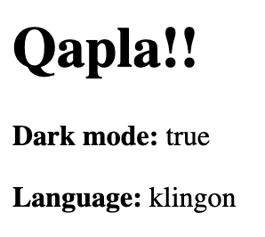

### What is [Context](https://reactjs.org/docs/context.html)?

- In a typical React application data flow is unidirectional, passed from parent to child.
- This can lead to an issue known as `props drilling`. Passing props from high level components down to low level ones creating repetitive code.

> Context provides a way to pass data through the component tree without having to pass props down manually at every level.

### When to use Context?

- Context is designed to share data that is considered `global` between a group of React components, especially when the data needs to be available to components at different levels.
- Data that does not need to be updated often should be placed in Context.
- Context should not be used as an entire state management system, its purpose is to make sharing data easier.

### Anatomy of Context

- **Provider** - The component that provides the value
- **Consumer** - A component that is consuming the value

### How to use Context?

1. Use the `createContext` method, create a context.
2. Wrap your context provider around the component tree.
3. Populate the value prop of the context provider with what you want to share.
4. Within any component use the context consumer or `useContext` hook to read the value.

> Completed example: https://codesandbox.io/s/how-to-use-context-givqez

```javascript
import React from 'react';

// 1. Create a context
// Populate with default value
export default React.createContext({
  darkMode: false,
  language: 'english'
});
```

> theme-context.js

```jsx
import React from 'react';
import Profile from './profile';
import ThemeContext from './theme-context';

const App = () => {
  // 2. Wrap component tree with context provider
  // 3. Populate value prop
  return (


  )
};

export default App;
```

> App.js

```jsx
import React, { useContext } from "react";
import ThemeContext from "./theme-context";

const Profile = () => {
  // 4. Read the value from the context
  const { darkMode, language } = useContext(ThemeContext);

  return (

      <h1>Qapla!!</h1>
      <p>
        <b>Dark mode:</b> {String(darkMode)}
      </p>
      <p>
        <b>Language:</b> {language}
      </p>

  );
};

export default Profile;
```

> profile.js

The theme settings were read from the context


> Completed example: https://codesandbox.io/s/how-to-use-context-givqez

## Performance issues with Context

- When the value of the context changes, all components that consume the context will rerender.
- All this additional rerendering could create performance issues if the Context spans a large component tree.

## React performance improvements

### Equality in Javascript

```javascript
1 === 1 // true
'a' === 'a' // true
true === true // true
{} === {} // false
[] === [] // false
() => {} === () => {} // false
```

- Two objects are considered equal when they point to the same memory location.

```javascript
const obj = {};
obj === obj // true
```

- React uses equality checks like these when deciding to rerender a component.

### React component rerendering

What can trigger a component rerender?

- **Changing state**
- **Changing props**
- **Parent component rerendering**
  - When a component rerenders, all child components will rerender regardless of state or prop changes
- React uses the [Object.is](https://developer.mozilla.org/en-US/docs/Web/JavaScript/Reference/Global_Objects/Object/is#description) comparison algorithm to check for changes.
- Object.is determines whether two values are the same value.
- Two values are the same if one of the following is true:
  > - both **undefined**
  > - both **null**
  > - both **true** or both **false**
  > - both **strings** of the same length with the same characters in the same order
  > - both the same **object** (meaning both values reference the same object in memory)
  > - both **numbers** and
  > - both +0
  > - both -0
  > - both NaN
  > - or both non-zero and both not NaN and both have the same value

## React.memo

- `React.memo` is a higher order component.
- If your component will render the same result with the same props, you can wrap it in a call to `React.memo`.
- `React.memo` will memoize the render result which means that React will skip rendering the component, and reuse the last rendered result providing a performance boost.
- `React.memo` only checks for prop changes though. If your component has a `useState` or `useContext` Hook, it will still rerender when state or context change.
- `React.memo` is best used on components that don’t have their own state and rely on their props for data.
- A good use case for using `React.memo` is taking a large form and splitting it up into smaller section components. Use `React.memo` to prevent unrequired rerenders when updating different sections.

### React.memo example

```javascript
import React from 'react';

const Post = ({ title, description }) => {
  // component code
}

export default React.memo(Post);
```

> React.memo example: https://codesandbox.io/s/react-memo-example-bhi4ne

`React.memo` can accept a second function param for custom prop equality checks.

```jsx
import React from 'react';

const Form = ({ onChange, formData }) => {
  // component code
}

const areEqual = (props, nextProps) => {
  return (
    Object.keys(props.formData).every(
      (key) =>
        nextProps.formData.hasOwnProperty(key) &&
        props.formData[key] === nextProps.formData[key]
    )
  );
};

export default React.memo(Form, areEqual);
```

> React.memo example: https://codesandbox.io/s/react-memo-example-bhi4ne

### [useMemo](https://reactjs.org/docs/hooks-reference.html#usememo)

- The `useMemo` Hook returns a memoized value.
- `useMemo` accepts two parameters. The first is a function to get the memoizable value. The second is a dependency array.

```javascript
const memoizedValue = useMemo(() => computeExpensiveValue(a, b), [a, b]);
```

- The function will only run during first render and when a dependency changes otherwise the memoized value is returned.
- If no dependencies provided the value is computed on every render.
- Can provide a performance improvement memoizing expensive values.

```javascript
import { useState, useMemo } from 'react';

const parseData = data => 42;

const Component = () => {
  const [data, setData] = useState([]);
  const importantValue = useMemo(() => parseData(data), [data])
};
```

> useMemo Hook example: https://codesandbox.io/s/usememo-example-0h7jpl

### [useCallback](https://reactjs.org/docs/hooks-reference.html#usecallback)

- The `useCallback` Hook returns a memoized callback function.
- `useCallback` accepts two parameters. The first is the function to be memoized. The second is a dependency array.
- Every value referenced inside the callback should also appear in the dependencies array

```javascript
const memoizedCallback = useCallback(
  () => {
    doSomething(a, b);
  },
  [a, b],
);
```

- The memoized callback will only change if one of the dependencies does.
- Use with a memoized child component to prevent rerenders.

```jsx
import { useState, useCallback } from "react";

import Numbers from "./numbers";

const randomInt = () => {
  return Math.floor(Math.random() * 50) + 1;
};

const App = () => {
  const [numbers, setNumbers] = useState([]);

  const addNumber = useCallback(() => {
    setNumbers((previous) => [...previous, randomInt()]);
  }, []);

  return (
    <div>

    </div>
  );
};

export default App;
```

> useCallback Hook example: https://codesandbox.io/s/usecallback-example-pv8jw4

## Custom Hooks

### Create Custom Hooks

- Hooks are reusable functions. Extract functionality used by multiple components into a Hook.
- Hook names should start with `use`.
- You can call any other Hooks from within your custom Hook.

> Example using a custom useCRUD Hook: https://codesandbox.io/s/context-and-hooks-complete-usecrud-sh9p6f
> Example using a custom useResource Hook: https://codesandbox.io/s/context-and-hooks-complete-useresource-kmu7jx
> React.memo example uses custom useRenderCounter Hook: https://codesandbox.io/s/react-memo-example-bhi4ne
> useCallback example uses custom useRenderCounter Hook: https://codesandbox.io/s/usecallback-example-pv8jw4

## Examples

### 1. Posts App with useResource Hook

This is an alternative approach to the [tutorial example](https://codesandbox.io/s/context-and-hooks-complete-usecrud-sh9p6f) which uses a new custom Hook `useResouce`.

`useResource` provides CRUD functionality similar to `useCRUD` but it interacts with a provided API endpoint instead. The API in use here is `https://jsonplaceholder.typicode.com/posts` which is a handy endpoint to use when testing out asynchronous actions in React.

<https://codesandbox.io/s/context-and-hooks-complete-useresource-kmu7jx>

### 2. React.context

This example shows the use of the React Context API and how to test it.

<https://codesandbox.io/s/how-to-use-context-givqez>

#### 2.1 Testing context:

##### 2.1.1 Testing the context through `App`

This example tests:

- Displaying the values from the context

<https://codesandbox.io/s/how-to-use-context-givqez?file=/src/App.test.js>

##### 2.1.2 Testing the context through `Profile`

This example tests:

- Profile wrapped in ThemeContext.Provider shows value from context
- Profile not wrapped in ThemeContext.Provider shows default value from context

<https://codesandbox.io/s/how-to-use-context-givqez?file=/src/profile.test.js>

### 3. React.memo

This example shows the use of `React.memo` with custom equality check to prevent rerenders. Testing is also provided using testing library.

There is also a custom Hook implemented here `useRenderCounter` which is used to display the render count for the components. This demonstrates how `React.memo` can prevent rerenders.

<https://codesandbox.io/s/react-memo-example-bhi4ne>

### 4. useMemo

This example shows the usefulness of the `useMemo` Hook at preventing unnecessary reruns of expensive methods. Testing is also provided using testing library.

<https://codesandbox.io/s/usememo-example-0h7jpl>

### 5. useCallback

This example shows the usefulness of the `useCallback` Hook at preventing rerenders when using optimized child components.

<https://codesandbox.io/s/usecallback-example-pv8jw4>

### Tutorial

Please have a look at my tutorial on using context in React along with creating and using custom Hooks. I also cover testing context and Hooks using React testing library. Please see also my post on using testing library.

[React context and custom Hooks tutorial](https://jonathan-meaney.dev/2024/06/15/react-context-and-custom-hooks-tutorial/)

[Introduction to User-Centric UI Testing with React Testing Library](https://jonathan-meaney.dev/2024/06/15/introduction-to-user-centric-ui-testing-with-react-testing-library/)
