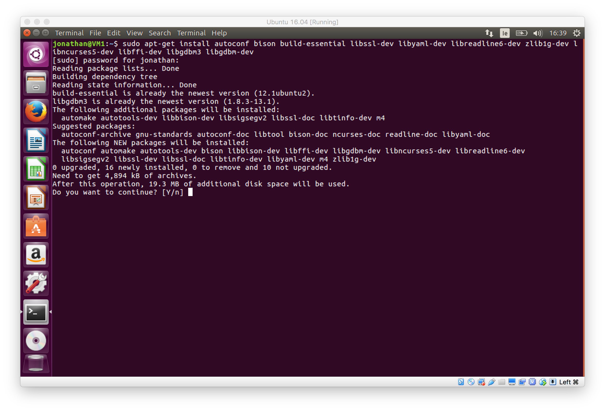
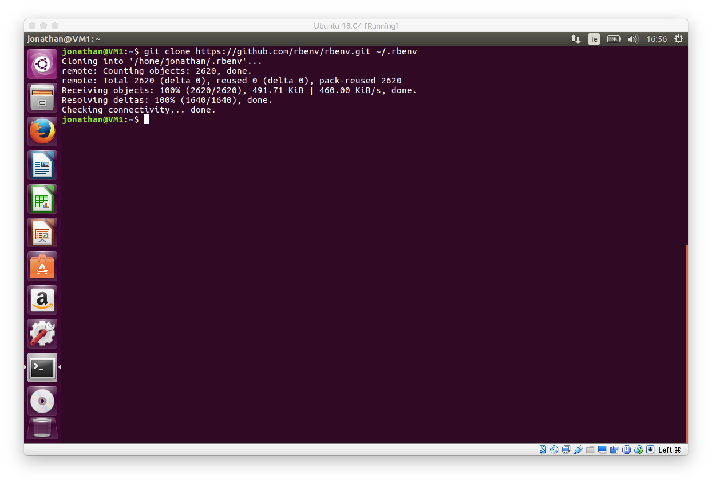
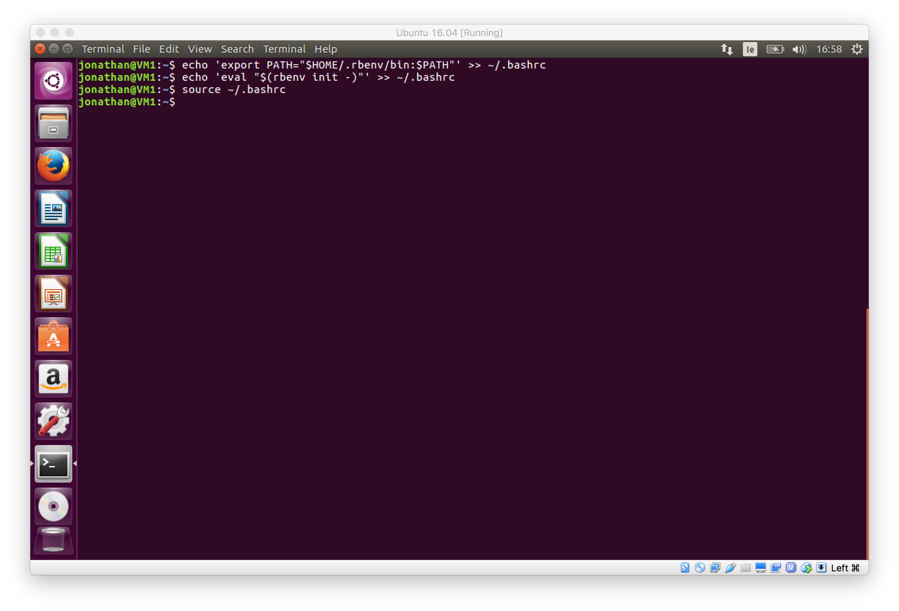
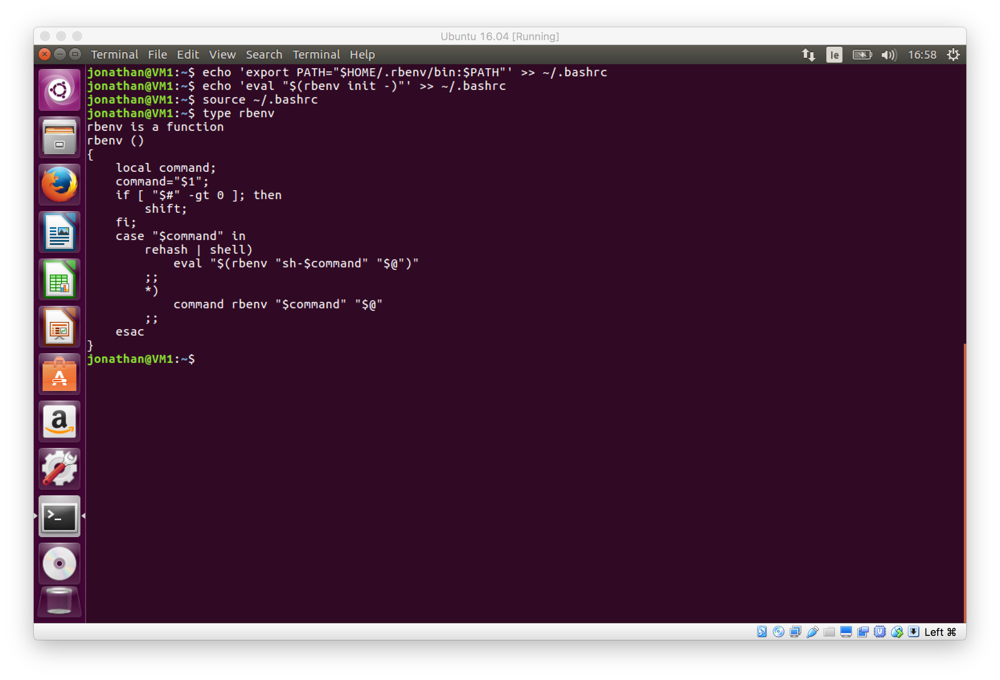
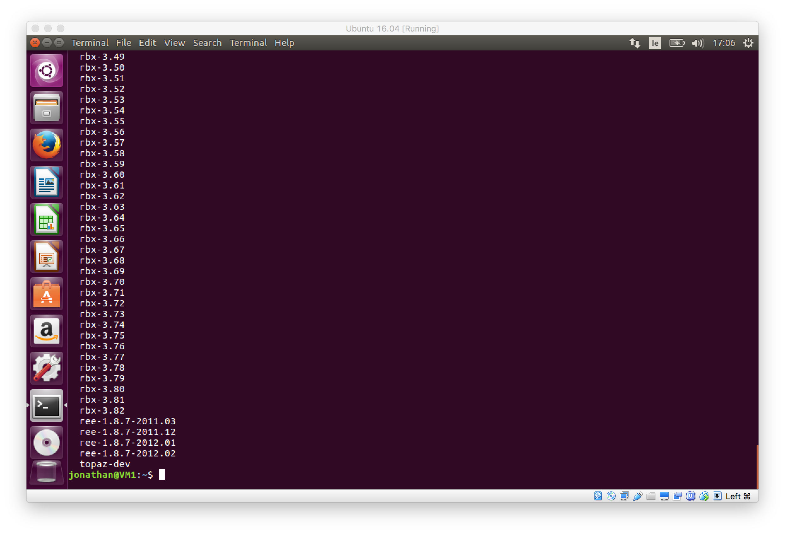
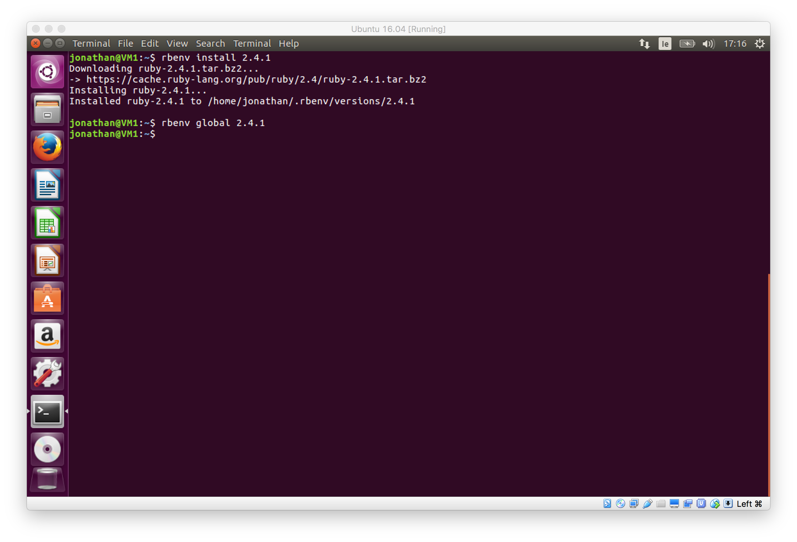
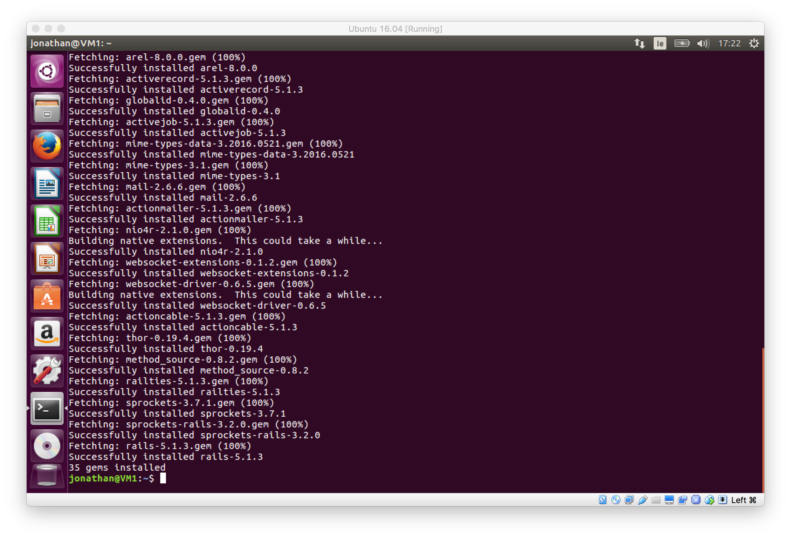
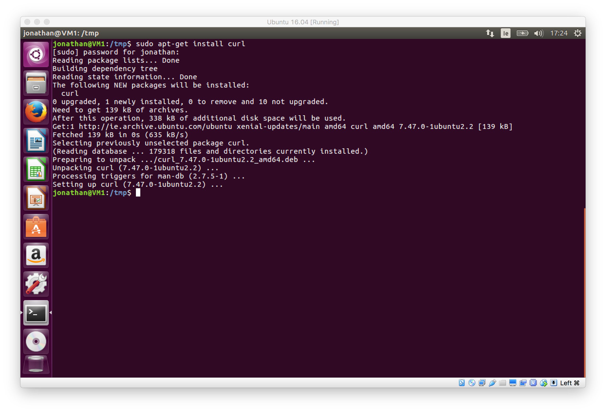

If you're still new to Ubuntu I've a post with some useful commands that'll help you navigate and use the terminal!
[Useful Unix Commands for macOS or Linux](http://jonathan-meaney.com/2017/08/08/useful-commands-for-unix-based-os-terminal/)

### Update and install some dependencies

**apt-get** is a package manager command line tool similar to **Homebrew** on macOS and is used to manage applications on Ubuntu. Lets update the cached packages to make sure the latest versions are available. Run the following command from the terminal.

```
sudo apt-get update
```

[gallery ids="703,704,705,706" columns="2" size="large"]
Now that **apt-get** is updated we'll need to install some libraries that **Rbenv** and **Ruby** require. The following command will install the list of libraries that are needed. Run it in the terminal as well.

```
sudo apt-get install autoconf bison build-essential libssl-dev libyaml-dev libreadline6-dev zlib1g-dev libncurses5-dev libffi-dev libgdbm3 libgdbm-dev
```



Sometimes prompts will ask you if you want to proceed because some additional disk space is going to be used. Type Y and press enter to proceed.

When the libraries have finished installing we can move to the next step.

### Installing Git

Git didn't come installed on this version of Ubuntu. Git is a version control system. We can use it to get applications that aren't available through **apt-get.**Use apt-get to install git using the command below.

```
sudo apt-get install git
```

When git is installed we'll be able to use the **git clone** command to download repositories from **github**.

### Installing Rbenv

We can use git to clone the Rbenv code from its repository on github and put it in the hidden **.rbenv**directory. The following command will do just that! run it in the terminal.

```
git clone https://github.com/rbenv/rbenv.git ~/.rbenv
```



Cloning the Rbenv repository

Now that we have Rbenv downloaded we'll need to run a few commands to add Rbenv to the **$PATH** so we'll have access to the **rbenv** command on the terminal and also Rbenv will be loaded automatically. The following commands will add to the **bashrc** file. **Bashrc** is a shell script that bash runs when its started. **Bash** is basically the command line in the terminal. Run these on the terminal.

```
echo 'export PATH="$HOME/.rbenv/bin:$PATH"' >> ~/.bashrc
echo 'eval "$(rbenv init -)"' >> ~/.bashrc
source ~/.bashrc
```



The commands dont return any output

Now we can check if everything has been setup correctly. We can use the **type**command to check for **rbenv**. Run the following from the terminal.

```
type rbenv
```



If everything is setup you should see rbenv is a function followed by several lines of code.

If you don't see the above then maybe you have missed one of the previous steps. Check over them and try again.
To be able to install versions of Ruby with Rbenv we'll need to install the Rbenv **ruby-build** plugin. This will be cloned from Github too. The following command will clone **ruby-build** into the Rbenv plugins directory.

```
git clone https://github.com/rbenv/ruby-build.git ~/.rbenv/plugins/ruby-build
```

This will give Rbenv the **install** command and we can use that to install a version of Ruby.

### Installing Ruby

If you have everything setup correctly we can then move onto installing Ruby. First we'll list the versions of Ruby that are available to install. Run the following command in terminal.

```
rbenv install -l
```



You'll get a huge list of versions

Im going to install the latest stable version of Ruby which is **2.4.1** and make it the global version of Ruby. You can install and version you wish just change **2.4.1** to your desired version. Run the following commands. The install could take some time.

```
rbenv install 2.4.1
rbenv global 2.4.1
```



Installing Ruby 2.4.1 and making it global.

When the installation is finished. You can check that the installed version of Ruby is available by running the following command.

```
ruby -v
```

### Install Bundler

We'll need to install bundler to manage our gems for Rails applications.

```
gem install bundler
```

### Installing Rails

Now lets install the latest version of Rails. Similar to the previous step run

```
gem install rails
```

This installs the latest version of Rails, **5.1.1**at time of writing. It could take a few minutes.


Output from Rails gem installation

Whenever you install a version of Ruby or a gem that provides commands you will need to rehash Rbenv. Run

```
rbenv rehash
```

You can then check the version of Rails installed by running

```
rails -v
```

It should be **5.1.1**

### Installing A JavaScript Runtime

Some Rails features such as the Asset Pipeline require a Javascript Runtime to be installed. We're going to install **NodeJS** for this. Before we can download the package we'll need to install **curl**. Curl is used for transferring data. We can install it using **apt-get** by running

```
sudo apt-get install curl
```



apt-get output for installing curl

With curl installed we can use it to download the latest version of NodeJS 6 and install it using **apt-get**

```
curl -sL https://deb.nodesource.com/setup_6.x | sudo -E bash -
sudo apt-get install -y nodejs
```

[gallery ids="834,835" columns="2" size="large"]

### Using SQLite

If you want to use the standard SQLite database that is the default lightweight database for a new Rails app you will need to install an additional library, **libsqlite3-dev**. Use apt-get to install it using the following command.

```
sudo apt-get install libsqlite3-dev
```

Without this library an error will occur when bundle is installing the gems for a new Rails application that uses SQLite.

### Finally Create a Rails app

Everything should now be set up and ready to go. Create a Rails app to test it all out. Navigate to the directory you want to create the app and run

```
rails new testapp
```

You should see all the normal output and gems installing. You should now be ready to go with developing Rails apps on Ubuntu 16.04. This was all done on a Virtual copy of Ubuntu 16.04 running on Virtual Box.
