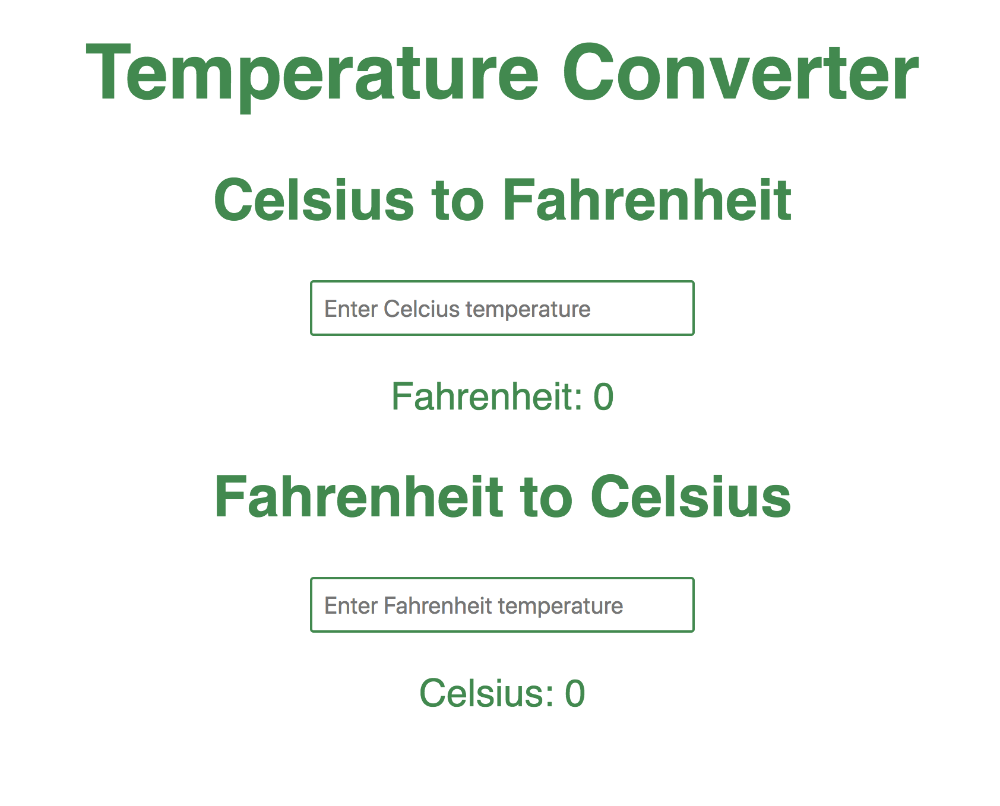
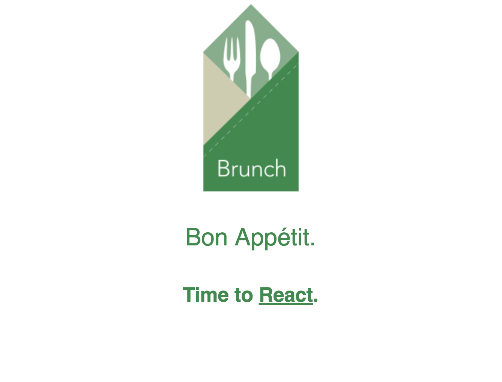

This is a simple tutorial to create a basic React app using Brunch as our starting point. The final app will be a basic temperature converter that converts temperatures between Celsius and Fahrenheit. Life changing stuff! Get ready to become a billionaire. Here is what we the app will look like when we're done.


Final Temperature Converter

I also have the completed code available on my [github](https://github.com/jonathanmeaney/temparature_converter) You'll also need to have Brunch installed. I've a post going through the install and use of Brunch [here](http://jonathan-meaney.com/2018/03/14/basic-brunch-example/)

## Creating the Skeleton app using Brunch

First open the terminal and navigate to wherever you want to create the app. When you are ready, run the Brunch command to create the Skeleton app. We're going to use the Brunch React Skeleton.

```
brunch new --skeleton brunch/with-react
```

This will clone the skeleton and run **npm install** for you which installs all the dependencies the application will need, so when this is done we are ready to get started creating the app. First make sure to start the server for the application by running the following command from the same directory you ran **brunch new** in.

```
brunch watch --server
```

This starts the server and watches for any changes and instantly updates the browser. Open your browser and go to the following URL <http://localhost:3333> you will see something like this.


Brunch React Skeleton Initial Page

When you make any changes to the code the browser will update pretty much straight away which is very handy.

## Setting up the UI

### Adding the UI elements

The UI is very basic for the app. Its basically just three headings, two inputs and two paragraphs that will be used to display the results. The inputs are type number to limit entry to just numbers and decimals which is helpful since we only want numbers. There is an input for each temperature type. The html for this is below. This is what the **render()**function in our React component will return.
https://gist.github.com/jonathanmeaney/8fc0270aa6dbe45fbcd1506594cfb412
You can copy the above html and replace the current contents of the **render()** function in **app/components/\*\***App.jsx\*\*it should now look like this
https://gist.github.com/jonathanmeaney/4c5bb9538f3552f9a926b5ef3224afa5

### Update styling

## Making the UI interactive

### Component State

### Conversion Functions

### Update the UI

##
